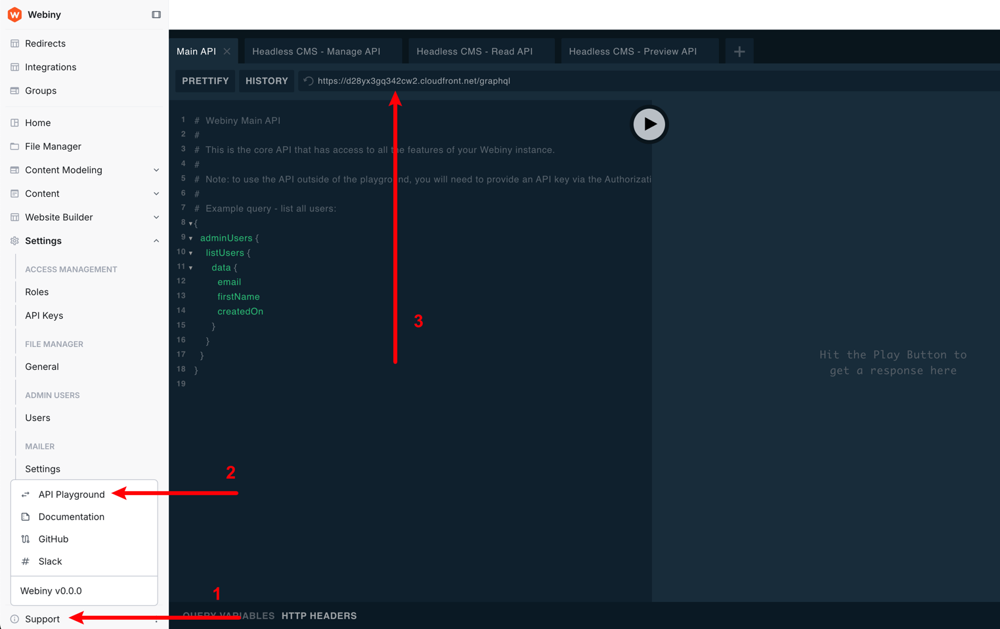
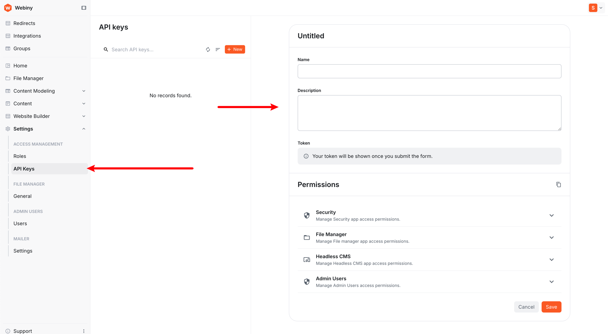

# Webiny Website Builder — Next.js Starter

A Next.js starter kit for building sites powered by the [Webiny Website Builder](https://www.webiny.com/docs/website-builder/introduction).

> [!NOTE]
> This is a starter project. You're free to change everything.

> [!WARNING]
> Match the branch to your Webiny version. If your Webiny project runs on `v6.0.0-alpha.2`, check out the matching branch. If no exact match exists, use the closest one and update `@webiny/website-builder-nextjs` in `package.json` to your version.

## What's included

- Next.js App Router
- TypeScript
- Tailwind CSS v4 with a semantic color token system
- Sample custom components (`Banner`, `Hero1`)
- Content SDK setup with draft mode and tenant support
- Preview and redirect API routes

## Project structure

```
src/
├── app/
│   ├── [[...slug]]/        # Catch-all page route (static generation)
│   ├── api/
│   │   ├── preview/        # Draft mode enable/disable
│   │   └── redirects/      # Redirect handling
│   └── layout.tsx
├── components/             # Shared UI (Header, PageLayout, NotFound, DocumentRenderer)
├── contentSdk/             # Content SDK initialization and tenant resolution
├── editorComponents/       # Custom builder components registered with DocumentRenderer
├── theme/
│   ├── tailwind.css        # Tailwind import + semantic @theme token mappings
│   ├── wbTheme.css         # CSS variables, typography classes (processed outside Tailwind)
│   └── wbTheme.ts          # Theme definition passed to the Website Builder SDK
└── utils/                  # Slug normalization helpers
```

## Connecting to Webiny

You'll need three values from your Webiny project:

- **API host URL** — e.g. `https://d2pectsnqadb1k.cloudfront.net` (no trailing slash)
- **API key** — created in Settings → Access Management → API Keys
- **Tenant ID** — e.g. `root` for the default tenant

#### 1. API host URL

Log in to your Webiny Admin app and open the **API Playground** (Support → API Playground). Copy the URL without the `/graphql` suffix.



#### 2. API key

Go to Settings → Access Management → API Keys and create a new key. Ensure it has access to Website Builder, then copy the value.



#### 3. Tenant ID

The tenant ID is visible in your Webiny Admin URL. For most projects it is `root`.

#### 4. (Optional) Admin app host URL

If your Next.js project is embedded in an editor hosted on a different domain, you must whitelist that domain. Set `NEXT_PUBLIC_WEBSITE_BUILDER_ADMIN_HOST` and add the domain to the `Content-Security-Policy` header in `next.config.ts` (see [Cross-Origin Configuration](#cross-origin-configuration)).

### Environment variables

Create a `.env` file at the project root:

```dotenv
NEXT_PUBLIC_WEBSITE_BUILDER_API_KEY=your_api_key
NEXT_PUBLIC_WEBSITE_BUILDER_API_HOST=https://your-api-host.cloudfront.net
NEXT_PUBLIC_WEBSITE_BUILDER_API_TENANT=root

# Optional — required only if editor is on a different domain
NEXT_PUBLIC_WEBSITE_BUILDER_ADMIN_HOST=https://your-admin-host.cloudfront.net
```

## Theme

### CSS variables (`src/theme/wbTheme.css`)

All design tokens are defined as CSS custom properties in `:root`. This file is compiled and injected into the Website Builder SDK at build time — it runs outside of Tailwind's pipeline, so only standard CSS is supported here.

Default semantic color tokens:

| Variable                      | Default   | Role              |
| ----------------------------- | --------- | ----------------- |
| `--wb-theme-color-primary`    | `#4632f5` | Brand / CTA       |
| `--wb-theme-color-secondary`  | `#00ccb0` | Accent            |
| `--wb-theme-color-background` | `#ffffff` | Page background   |
| `--wb-theme-color-surface`    | `#f9f9f9` | Cards, panels     |
| `--wb-theme-color-text-base`  | `#0a0a0a` | Body text         |
| `--wb-theme-color-text-muted` | `#6b7280` | Secondary text    |
| `--wb-theme-color-border`     | `#e5e7eb` | Dividers, borders |
| `--wb-theme-color-success`    | `#16a34a` | Positive states   |
| `--wb-theme-color-warning`    | `#d97706` | Caution states    |
| `--wb-theme-color-error`      | `#dc2626` | Errors            |

### Tailwind tokens (`src/theme/tailwind.css`)

All `--wb-theme-*` variables are mapped to Tailwind tokens via `@theme inline`, making them available as utility classes throughout your components:

```
bg-primary        text-primary        border-primary
bg-secondary      text-secondary
bg-background     text-text-base      text-text-muted
bg-surface        border-border
bg-success        bg-warning          bg-error
```

### Builder color palette (`src/theme/wbTheme.ts`)

All 10 tokens are exposed as swatches in the Website Builder editor color picker.

## Custom components

Register custom components in `src/editorComponents/index.tsx` using `createComponent`. Each component receives its inputs via `ComponentProps<TInputs>`:

```tsx
import { ComponentProps } from "@webiny/website-builder-nextjs";

interface BannerInputs {
  headline: string;
}

export function Banner({ inputs: { headline } }: ComponentProps<BannerInputs>) {
  return <div>{headline}</div>;
}
```

Then register it:

```tsx
createComponent(Banner, {
  name: "Custom/Banner",
  label: "Banner",
  inputs: [createTextInput({ name: "headline", label: "Headline" })],
});
```

> [!IMPORTANT]
> When passing inputs as an array, `name` is required in each `createTextInput` call so TypeScript can infer the correct type.

## Content SDK

The Content SDK lives in `src/contentSdk/`. The `initializeContentSdk.ts` file handles SDK setup and component group registration. Customize your groups there.

## Cross-Origin Configuration

If the Website Builder editor is hosted on a different domain than your Next.js app, whitelist the editor's origin in `next.config.ts`:

```ts
{
  key: "Content-Security-Policy",
  value: "frame-ancestors https://your-admin-host.cloudfront.net"
}
```

## SDK versioning

The `@webiny/website-builder-nextjs` package version should match your Webiny Admin app version so the Editor SDK and Content SDK stay in sync. Update the version in `package.json` after cloning.

> [!TIP]
> Inline comments throughout the source code provide additional context on implementation details.
